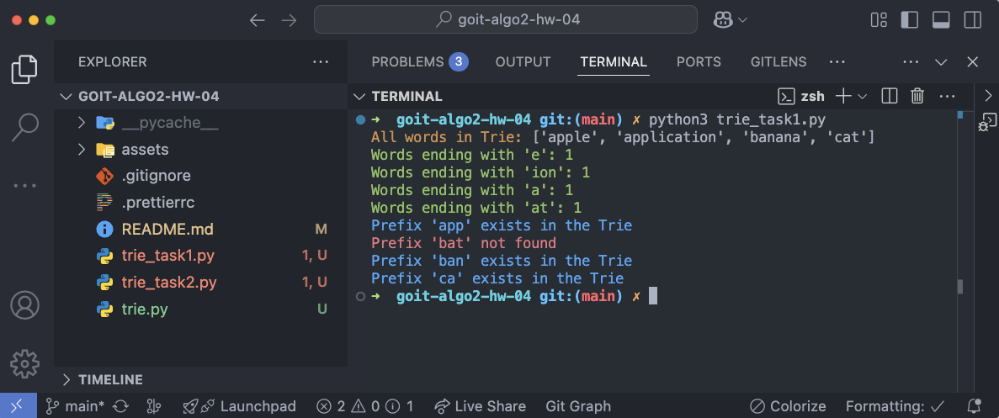
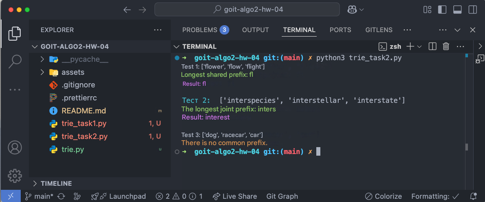

# Homework on the topic "Prefix Trees"

Welcome to the homework on the topic "Prefix Trees"! 🙂

The homework will consist of two independent tasks.

By diving into working with prefix trees through these practical tasks, you will
discover a powerful tool for processing text data. By expanding the
functionality of the Trie tree, you will not only learn the theory, but also
understand how this data structure helps to solve real-world problems of text
search and analysis.

By implementing methods for working with suffixes and prefixes, you will see how
modern autocomplete and spell check systems work. And the task of finding the
longest common prefix will teach you how to optimize algorithms, taking into
account both performance and memory usage.

Experience with prefix trees will provide you with a solid foundation for
learning more complex algorithms and data structures, especially if you plan to
work with natural language processing or search engines.

This is not just an educational exercise - it is your step towards understanding
how modern text processing systems that we use every day are created.

## Task 1. Extending the functionality of the prefix tree

Implement two additional methods for the Trie class:

- count_words_with_suffix(pattern) to count the number of words that end with a
  given pattern;

- has_prefix(prefix) to check for the presence of words with a given prefix.

### Specifications

- The Homework class must inherit the base Trie class.

- The methods must handle errors of entering incorrect data.

- The input parameters of both methods must be strings.
- The count_words_with_suffix method must return an integer.
- The has_prefix method must return a boolean value.

### Acceptance criteria

📌Homework acceptance criteria are a mandatory condition for the assignment to
be considered by the mentor. If any of the criteria are not met, the mentor will
send the homework for revision without grading. If you "just need
clarification"😉 or you get stuck at some stage of the execution - contact the
mentor in Slack).

1. The count_words_with_suffix method returns the number of words ending in a
   given pattern. If there are no words, it returns 0. It takes into account the
   case of characters (10 points).

2. The has_prefix method returns True if there is at least one word with the
   given prefix. It returns False if there are no such words. It takes into
   account the case of characters (10 points).

3. The code passes all tests (10 points).

4. Incorrect input data is processed (10 points).

5. The methods work effectively on large data sets (10 points).

### Program template

```python

from trie import Trie

class Homework(Trie): def count_words_with_suffix(self, pattern) -> int: pass

def has_prefix(self, prefix) -> bool:
pass

if **name** == "**main**": trie = Homework() words = ["apple", "application",
"banana", "cat"] for i, word in enumerate(words): trie.put(word, i)

# Check the number of words ending with a given suffix
assert trie.count_words_with_suffix("e") == 1 # apple
assert trie.count_words_with_suffix("ion") == 1 # application
assert trie.count_words_with_suffix("a") == 1 # banana
assert trie.count_words_with_suffix("at") == 1 # cat

# Check the presence of a prefix
assert trie.has_prefix("app") == True # apple, application
assert trie.has_prefix("bat") == False
assert trie.has_prefix("ban") == True # banana
assert trie.has_prefix("ca") == True # cat
```

## Task 2. Finding the longest common prefix

Create a class LongestCommonWord that inherits the Trie class and implement the
method find_longest_common_word that finds the longest common prefix for all
words in the input array of strings.

### Specifications

- The LongestCommonWord class must inherit Trie.
- The input parameter of the method find_longest_common_word, strings — an array
  of strings.
- The method find_longest_common_word must return a string — the longest common
  prefix.
- Execution time — O ( S ) O(S), where S S — the total length of all strings.

### Acceptance criteria

1. Method find_longest_common_word:

- returns the longest prefix common to all words (10 points),
- returns an empty string if there is no common prefix (10 points),
- correctly processes an empty array or incorrect input data (10 points).

2. The code passes all tests (20 points).

### Program Template

```python
from trie import Trie

class LongestCommonWord(Trie):

def find_longest_common_word(self, strings) -> str:
pass

if **name** == "**main**": # Tests trie = LongestCommonWord() strings =
["flower", "flow", "flight"] assert trie.find_longest_common_word(strings) ==
"fl"

trie = LongestCommonWord()
strings = ["interspecies", "interstellar", "interstate"]
assert trie.find_longest_common_word(strings) == "inters"

trie = LongestCommonWord()
strings = ["dog", "racecar", "car"]
assert trie.find_longest_common_word(strings) == ""
```

## Preparing and uploading homework

1. Create a public repository goit-algo2-hw-04.

2. Complete the task and push it to your repository.

3. Download the working files yles to your computer and attach them to the LMS
   in zip format. The archive name must be in the format DZ4_NAME.

4. Attach a link to the goit-algo2-hw-04 repository and send it for
   verification.

## Submission format

- Attached repository files in zip format with the name DZ4_NAME.

- Link to the repository.

## Evaluation format

Score from 0 to 100.

Task 1 is evaluated at 50 points.

Task 2 is evaluated at 50 points.

Detailed distribution of points is indicated in the acceptance criteria.

☝🏻ATTENTION!! You have the opportunity to choose an approach to completing and
possibly completing the homework: be satisfied with the first grade received (of
course, if it is higher than the passing grade), try to get a higher grade by
possibly further refining the work in accordance with the mentor's feedback. The
chosen approach to completing the homework must be indicated in the submission
field for the attached task. In the absence of a comment, the mentor adheres to
the first approach and issues the received grade. 💡 Send the homework for
verification when everything possible has been done, because the number of
attempts to complete the task affects the score received! For each subsequent
attempt after the second (i.e. from the third) the maximum possible number of
points is reduced by 5. Criteria for assessing works in the GoIt Neoversity
master's degree

### Result of the completed DZ

#### Task 1



#### Task 2


